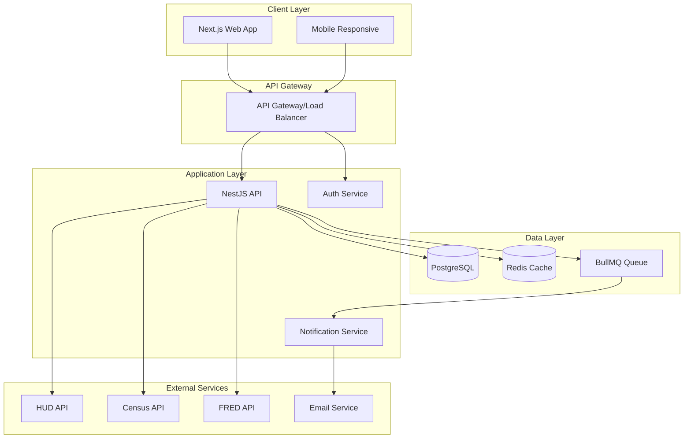

# 🏗️ System Architecture

## Overview

The Housing & Rent Trends Dashboard follows a modern microservices architecture with clear separation of concerns, designed for scalability, maintainability, and comprehensive testing.

## Architecture Diagram



## Component Architecture

### Frontend (Next.js)

```
apps/web/
├── app/                    # App Router pages
│   ├── (auth)/            # Auth-required pages
│   ├── (public)/          # Public pages
│   ├── api/               # API routes
│   └── layout.tsx         # Root layout
├── components/
│   ├── ui/                # Base UI components
│   ├── features/          # Feature-specific components
│   ├── charts/            # Data visualization
│   └── maps/              # Map components
├── lib/
│   ├── api/               # API client
│   ├── hooks/             # Custom React hooks
│   ├── stores/            # Zustand stores
│   └── utils/             # Utility functions
└── styles/                # Global styles
```

### Backend (NestJS)

```
apps/api/
├── src/
│   ├── modules/
│   │   ├── auth/          # Authentication module
│   │   ├── users/         # User management
│   │   ├── housing/       # Housing data module
│   │   ├── notifications/ # Email notifications
│   │   └── search/        # Search & filtering
│   ├── common/
│   │   ├── guards/        # Auth guards
│   │   ├── interceptors/  # Request/Response interceptors
│   │   ├── pipes/         # Validation pipes
│   │   └── filters/       # Exception filters
│   └── config/            # Configuration
└── test/                  # Integration tests
```

## Data Flow

### 1. User Request Flow
```
User Action → Next.js → API Gateway → NestJS → Database → Response
```

### 2. Data Sync Flow
```
Scheduled Job → Government APIs → Data Parser → PostgreSQL → Cache Invalidation
```

### 3. Notification Flow
```
User Preference → BullMQ Queue → Notification Worker → Email Service → User
```

## Key Design Patterns

### 1. Repository Pattern
- Abstracts data access logic
- Enables easy testing with mocks
- Supports multiple data sources

### 2. Service Layer Pattern
- Business logic separation
- Reusable across controllers
- Testable in isolation

### 3. Observer Pattern
- Real-time updates via WebSockets
- Event-driven notifications
- Decoupled components

### 4. Cache-Aside Pattern
- Redis for frequently accessed data
- Reduced database load
- Improved response times

## Security Architecture

### Authentication & Authorization
- JWT-based authentication
- Refresh token rotation
- Role-based access control (RBAC)
- OAuth 2.0 integration

### API Security
- Rate limiting per user/IP
- Input validation & sanitization
- SQL injection prevention (Prisma)
- XSS protection
- CORS configuration

### Data Protection
- Encryption at rest (database)
- Encryption in transit (HTTPS)
- Sensitive data masking
- GDPR compliance

## Performance Optimization

### Frontend
- Server-side rendering (SSR)
- Static generation for public pages
- Image optimization
- Code splitting
- Lazy loading
- Progressive Web App (PWA)

### Backend
- Database query optimization
- Connection pooling
- Response caching
- Pagination
- GraphQL (future consideration)

### Infrastructure
- CDN for static assets
- Load balancing
- Auto-scaling
- Health checks

## Testing Architecture

### Testing Pyramid
```
         /\
        /E2E\        (10%)
       /------\
      /  API   \     (20%)
     /----------\
    /Integration \   (30%)
   /--------------\
  /     Unit       \ (40%)
 /------------------\
```

### Test Types
1. **Unit Tests**: Individual functions/components
2. **Integration Tests**: Module interactions
3. **API Tests**: Endpoint testing
4. **E2E Tests**: User workflows

## Deployment Architecture

### Environments
- **Development**: Local Docker setup
- **Staging**: Mirrors production
- **Production**: High availability setup

### CI/CD Pipeline
```
Code Push → GitHub Actions → Build → Test → Deploy → Monitor
```

### Monitoring & Observability
- Application monitoring (Sentry)
- Performance monitoring (Lighthouse)
- Log aggregation (CloudWatch/Datadog)
- Custom metrics & dashboards

## Scalability Considerations

### Horizontal Scaling
- Stateless API servers
- Database read replicas
- Redis cluster
- Load balancer distribution

### Vertical Scaling
- Database optimization
- Caching strategies
- Query optimization
- Index management

## Future Enhancements

### Phase 1 (Current)
- Core functionality
- Basic authentication
- Essential features

### Phase 2
- Advanced analytics
- Machine learning predictions
- Mobile app

### Phase 3
- GraphQL API
- Real-time collaboration
- AI-powered insights