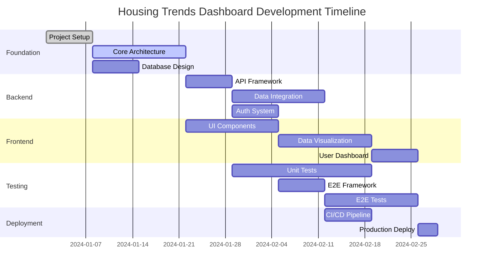

# 🗺️ Development Roadmap

## Project Timeline Overview

## Phase 1: Foundation (Weeks 1-2) ✅

### Week 1: Project Setup
- [x] Initialize monorepo structure
- [x] Configure TypeScript
- [x] Set up development environment
- [x] Docker services configuration
- [x] Documentation structure

### Week 2: Core Architecture
- [ ] Set up Next.js application
- [ ] Configure NestJS backend
- [ ] Establish API communication
- [ ] Set up Prisma ORM
- [ ] Configure Redis caching

## Phase 2: Backend Development (Weeks 3-5)

### Week 3: Data Layer
- [ ] Design database schema
- [ ] Create Prisma models
- [ ] Set up migrations
- [ ] Implement repositories
- [ ] Add data validation

### Week 4: External API Integration
- [ ] HUD API integration
- [ ] Census Bureau API integration
- [ ] FRED API integration
- [ ] Data transformation services
- [ ] Caching strategy implementation

### Week 5: Authentication & Authorization
- [ ] JWT authentication
- [ ] User registration/login
- [ ] Password reset flow
- [ ] OAuth integration (Google)
- [ ] Role-based access control

## Phase 3: Frontend Development (Weeks 6-8)

### Week 6: UI Foundation
- [ ] Component library setup (Shadcn/ui)
- [ ] Layout components
- [ ] Navigation system
- [ ] Form components
- [ ] Loading/Error states

### Week 7: Data Visualization
- [ ] Chart components (Recharts)
- [ ] Interactive maps (Mapbox)
- [ ] Data tables with sorting/filtering
- [ ] Export functionality (CSV/PDF)
- [ ] Responsive design

### Week 8: User Features
- [ ] User dashboard
- [ ] Search & filter interface
- [ ] Saved searches management
- [ ] Notification preferences
- [ ] Profile settings

## Phase 4: Testing Implementation (Weeks 9-11)

### Week 9: Testing Framework
- [ ] Playwright setup
- [ ] Test environment configuration
- [ ] Page Object Model structure
- [ ] Test data factories
- [ ] CI integration

### Week 10: Test Coverage
- [ ] Unit tests (80% coverage)
- [ ] Integration tests
- [ ] API endpoint tests
- [ ] Component tests
- [ ] E2E critical paths

### Week 11: Advanced Testing
- [ ] Visual regression tests (Percy)
- [ ] Performance tests (Lighthouse)
- [ ] Accessibility tests (axe-core)
- [ ] Load testing (K6)
- [ ] Security testing

## Phase 5: Production Ready (Weeks 12-13)

### Week 12: Deployment
- [ ] Production environment setup
- [ ] CI/CD pipeline completion
- [ ] Monitoring setup (Sentry)
- [ ] Analytics integration
- [ ] Documentation finalization

### Week 13: Polish & Launch
- [ ] Performance optimization
- [ ] SEO implementation
- [ ] Final testing
- [ ] Bug fixes
- [ ] Public launch

## Phase 6: Content & Growth (Ongoing)

### Blog Posts Schedule
1. **Week 2**: "Building a Testable Architecture from Day One"
2. **Week 4**: "Integrating Government APIs: Challenges and Solutions"
3. **Week 6**: "Component Testing Strategies with Testing Library"
4. **Week 8**: "Testing Interactive Maps and Data Visualizations"
5. **Week 10**: "E2E Testing Best Practices with Playwright"
6. **Week 11**: "Visual Regression Testing in Production"
7. **Week 12**: "CI/CD Pipeline for Full-Stack Applications"
8. **Week 13**: "Lessons Learned: Building a Test-First Application"

### Future Enhancements (Phase 7+)
- [ ] Mobile application
- [ ] Advanced analytics dashboard
- [ ] Machine learning predictions
- [ ] Real-time collaboration
- [ ] GraphQL API
- [ ] Internationalization
- [ ] Advanced notification system
- [ ] API for third-party developers

## Success Metrics

### Technical Metrics
- **Code Coverage**: > 80%
- **Build Time**: < 5 minutes
- **Test Execution**: < 10 minutes
- **Lighthouse Score**: > 90
- **Bundle Size**: < 200KB gzipped

### Quality Metrics
- **Bug Escape Rate**: < 5%
- **Test Flakiness**: < 1%
- **Code Review Coverage**: 100%
- **Documentation Coverage**: 100%

### Business Metrics
- **User Registration**: 100+ users in first month
- **Active Users**: 50+ weekly active users
- **GitHub Stars**: 50+ stars
- **Blog Views**: 1000+ views per post

## Risk Management

### Technical Risks
| Risk | Probability | Impact | Mitigation |
|------|------------|--------|------------|
| API Rate Limits | High | Medium | Implement caching, queue requests |
| Data Inconsistency | Medium | High | Validation layers, error handling |
| Performance Issues | Medium | Medium | Early optimization, monitoring |
| Test Flakiness | Medium | Low | Retry mechanisms, proper waits |

### Project Risks
| Risk | Probability | Impact | Mitigation |
|------|------------|--------|------------|
| Scope Creep | High | High | Clear requirements, MVP focus |
| Time Overrun | Medium | Medium | Buffer time, parallel work |
| Technical Debt | Medium | Medium | Regular refactoring, code reviews |

## Team Collaboration

### Communication Channels
- **GitHub Issues**: Feature requests, bugs
- **GitHub Discussions**: Architecture decisions
- **Pull Requests**: Code reviews
- **GitHub Projects**: Task tracking
- **Documentation**: Confluence/Notion

### Development Workflow
1. Create feature branch
2. Implement with tests
3. Create pull request
4. Code review
5. Run CI/CD checks
6. Merge to main
7. Auto-deploy to staging
8. Manual promote to production

## Learning Outcomes

By the end of this project, you will have:

### Technical Skills
- ✅ Modern TypeScript development
- ✅ Full-stack architecture design
- ✅ Comprehensive testing strategies
- ✅ CI/CD pipeline implementation
- ✅ Performance optimization
- ✅ Security best practices

### Testing Expertise
- ✅ E2E testing with Playwright
- ✅ API testing strategies
- ✅ Visual regression testing
- ✅ Performance testing
- ✅ Test automation patterns
- ✅ Test data management

### Portfolio Assets
- ✅ Production-ready application
- ✅ Open-source test framework
- ✅ Technical blog posts
- ✅ GitHub contributions
- ✅ Documentation samples

## Resources & References

### Documentation
- [Next.js Documentation](https://nextjs.org/docs)
- [NestJS Documentation](https://nestjs.com/)
- [Playwright Documentation](https://playwright.dev/)
- [Prisma Documentation](https://www.prisma.io/docs)

### Government APIs
- [HUD User API](https://www.huduser.gov/portal/dataset/fmr-api.html)
- [Census Bureau API](https://www.census.gov/data/developers.html)
- [FRED API](https://fred.stlouisfed.org/docs/api/)

### Learning Resources
- [Testing JavaScript](https://testingjavascript.com/)
- [Test Automation University](https://testautomationu.applitools.com/)
- [Modern Testing Practices](https://moderntesting.com/)

---

**Last Updated**: January 2024
**Status**: In Active Development
**Next Milestone**: Complete Phase 2 Backend