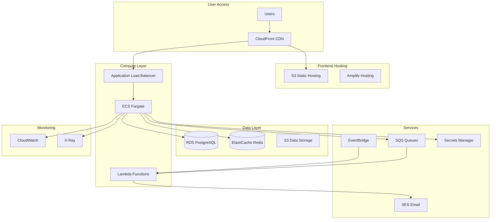

# 🌩️ AWS Architecture & Infrastructure

## Overview

The Housing Trends Dashboard leverages AWS services for a scalable, secure, and cost-effective cloud infrastructure with comprehensive CI/CD automation.

## Architecture Diagram



## AWS Services Breakdown

### Core Infrastructure

#### 1. **Compute Services**
- **ECS Fargate**: Serverless container hosting for backend API
- **Lambda**: Background jobs, data processing, scheduled tasks
- **EC2 (optional)**: Self-hosted runners for CI/CD

#### 2. **Storage & Database**
- **RDS PostgreSQL**: Primary database with Multi-AZ deployment
- **ElastiCache Redis**: Session storage and caching layer
- **S3**: Static assets, data exports, backups
- **EFS**: Shared storage for containers (if needed)

#### 3. **Networking**
- **VPC**: Isolated network with public/private subnets
- **ALB**: Load balancing with health checks
- **CloudFront**: Global CDN for static assets
- **Route 53**: DNS management and health checks

#### 4. **Application Services**
- **SQS**: Message queuing for async processing
- **SES**: Email notifications
- **EventBridge**: Event-driven architecture
- **Secrets Manager**: API keys and credentials
- **Parameter Store**: Configuration management

### CI/CD Pipeline

#### **AWS CodePipeline Architecture**

```yaml
Pipeline Stages:
  1. Source (CodeCommit/GitHub)
  2. Build (CodeBuild)
  3. Test (CodeBuild + Device Farm)
  4. Deploy Staging (CodeDeploy)
  5. E2E Tests (CodeBuild)
  6. Approval (Manual/Automated)
  7. Deploy Production (CodeDeploy)
```

### Monitoring & Observability

- **CloudWatch**: Logs, metrics, alarms
- **X-Ray**: Distributed tracing
- **CloudWatch Synthetics**: Synthetic monitoring
- **AWS Cost Explorer**: Cost optimization

## Infrastructure as Code

### AWS CDK (Recommended)

```typescript
// infrastructure/lib/housing-trends-stack.ts
import * as cdk from 'aws-cdk-lib';
import * as ec2 from 'aws-cdk-lib/aws-ec2';
import * as ecs from 'aws-cdk-lib/aws-ecs';
import * as rds from 'aws-cdk-lib/aws-rds';
import * as elasticache from 'aws-cdk-lib/aws-elasticache';

export class HousingTrendsStack extends cdk.Stack {
  constructor(scope: Construct, id: string, props?: cdk.StackProps) {
    super(scope, id, props);

    // VPC Configuration
    const vpc = new ec2.Vpc(this, 'HousingVPC', {
      maxAzs: 2,
      natGateways: 1,
      subnetConfiguration: [
        {
          name: 'Public',
          subnetType: ec2.SubnetType.PUBLIC,
          cidrMask: 24,
        },
        {
          name: 'Private',
          subnetType: ec2.SubnetType.PRIVATE_WITH_EGRESS,
          cidrMask: 24,
        },
        {
          name: 'Database',
          subnetType: ec2.SubnetType.PRIVATE_ISOLATED,
          cidrMask: 28,
        },
      ],
    });

    // RDS PostgreSQL
    const database = new rds.DatabaseInstance(this, 'Database', {
      engine: rds.DatabaseInstanceEngine.postgres({
        version: rds.PostgresEngineVersion.VER_15_3,
      }),
      instanceType: ec2.InstanceType.of(
        ec2.InstanceClass.T3,
        ec2.InstanceSize.MICRO,
      ),
      vpc,
      vpcSubnets: {
        subnetType: ec2.SubnetType.PRIVATE_ISOLATED,
      },
      multiAz: true,
      allocatedStorage: 20,
      storageEncrypted: true,
      databaseName: 'housing_trends',
      credentials: rds.Credentials.fromGeneratedSecret('postgres'),
    });

    // ElastiCache Redis
    const cacheSubnetGroup = new elasticache.CfnSubnetGroup(this, 'CacheSubnetGroup', {
      description: 'Subnet group for Redis cache',
      subnetIds: vpc.selectSubnets({
        subnetType: ec2.SubnetType.PRIVATE_WITH_EGRESS,
      }).subnetIds,
    });

    const cacheCluster = new elasticache.CfnCacheCluster(this, 'RedisCache', {
      cacheNodeType: 'cache.t3.micro',
      engine: 'redis',
      numCacheNodes: 1,
      cacheSubnetGroupName: cacheSubnetGroup.ref,
    });

    // ECS Fargate Cluster
    const cluster = new ecs.Cluster(this, 'Cluster', {
      vpc,
      containerInsights: true,
    });

    // ... Additional resources
  }
}
```

### Terraform Alternative

```hcl
# infrastructure/main.tf
provider "aws" {
  region = var.aws_region
}

module "vpc" {
  source = "terraform-aws-modules/vpc/aws"
  
  name = "housing-trends-vpc"
  cidr = "10.0.0.0/16"
  
  azs             = ["${var.aws_region}a", "${var.aws_region}b"]
  private_subnets = ["10.0.1.0/24", "10.0.2.0/24"]
  public_subnets  = ["10.0.101.0/24", "10.0.102.0/24"]
  
  enable_nat_gateway = true
  enable_vpn_gateway = false
  
  tags = {
    Environment = var.environment
    Project     = "housing-trends"
  }
}

module "rds" {
  source = "terraform-aws-modules/rds/aws"
  
  identifier = "housing-trends-db"
  
  engine            = "postgres"
  engine_version    = "15.3"
  instance_class    = "db.t3.micro"
  allocated_storage = 20
  
  db_name  = "housing_trends"
  username = "postgres"
  port     = "5432"
  
  vpc_security_group_ids = [module.security_group.security_group_id]
  
  maintenance_window = "Mon:00:00-Mon:03:00"
  backup_window      = "03:00-06:00"
  
  tags = {
    Environment = var.environment
  }
}
```

## Environment Configuration

### Development Environment

```yaml
Environment: Development
Services:
  - ECS Tasks: 1 (t3.micro)
  - RDS: db.t3.micro (Single-AZ)
  - ElastiCache: cache.t3.micro
  - Lambda: 128MB memory
Cost: ~$50-75/month
```

### Staging Environment

```yaml
Environment: Staging
Services:
  - ECS Tasks: 2 (t3.small)
  - RDS: db.t3.small (Single-AZ)
  - ElastiCache: cache.t3.small
  - Lambda: 256MB memory
Cost: ~$100-150/month
```

### Production Environment

```yaml
Environment: Production
Services:
  - ECS Tasks: 4-10 (Auto-scaling)
  - RDS: db.r6g.large (Multi-AZ)
  - ElastiCache: cache.r6g.large (Cluster mode)
  - Lambda: 512MB-1GB memory
  - CloudFront: Global distribution
Cost: ~$300-500/month
```

## CI/CD Pipeline Configuration

### AWS CodePipeline

```yaml
# buildspec.yml
version: 0.2

phases:
  pre_build:
    commands:
      - echo Logging in to Amazon ECR...
      - aws ecr get-login-password --region $AWS_DEFAULT_REGION | docker login --username AWS --password-stdin $AWS_ACCOUNT_ID.dkr.ecr.$AWS_DEFAULT_REGION.amazonaws.com
      - REPOSITORY_URI=$AWS_ACCOUNT_ID.dkr.ecr.$AWS_DEFAULT_REGION.amazonaws.com/$IMAGE_REPO_NAME
      - COMMIT_HASH=$(echo $CODEBUILD_RESOLVED_SOURCE_VERSION | cut -c 1-7)
      - IMAGE_TAG=${COMMIT_HASH:=latest}
  
  build:
    commands:
      - echo Build started on `date`
      - echo Installing dependencies...
      - pnpm install --frozen-lockfile
      - echo Running tests...
      - pnpm test
      - pnpm test:e2e
      - echo Building Docker image...
      - docker build -t $REPOSITORY_URI:latest .
      - docker tag $REPOSITORY_URI:latest $REPOSITORY_URI:$IMAGE_TAG
  
  post_build:
    commands:
      - echo Build completed on `date`
      - echo Pushing Docker images...
      - docker push $REPOSITORY_URI:latest
      - docker push $REPOSITORY_URI:$IMAGE_TAG
      - echo Writing image definitions file...
      - printf '[{"name":"housing-api","imageUri":"%s"}]' $REPOSITORY_URI:$IMAGE_TAG > imagedefinitions.json

artifacts:
  files: imagedefinitions.json

cache:
  paths:
    - 'node_modules/**/*'
    - '.pnpm-store/**/*'
```

### GitHub Actions with AWS

```yaml
# .github/workflows/aws-deploy.yml
name: Deploy to AWS

on:
  push:
    branches: [main]
  pull_request:
    branches: [main]

env:
  AWS_REGION: us-east-1
  ECR_REPOSITORY: housing-trends-api

jobs:
  test:
    runs-on: ubuntu-latest
    steps:
      - uses: actions/checkout@v3
      - uses: pnpm/action-setup@v2
      - uses: actions/setup-node@v3
        with:
          node-version: '20'
          cache: 'pnpm'
      
      - name: Install dependencies
        run: pnpm install --frozen-lockfile
      
      - name: Run tests
        run: |
          pnpm test
          pnpm test:e2e

  deploy:
    needs: test
    if: github.ref == 'refs/heads/main'
    runs-on: ubuntu-latest
    
    steps:
      - uses: actions/checkout@v3
      
      - name: Configure AWS credentials
        uses: aws-actions/configure-aws-credentials@v2
        with:
          aws-access-key-id: ${{ secrets.AWS_ACCESS_KEY_ID }}
          aws-secret-access-key: ${{ secrets.AWS_SECRET_ACCESS_KEY }}
          aws-region: ${{ env.AWS_REGION }}
      
      - name: Login to Amazon ECR
        id: login-ecr
        uses: aws-actions/amazon-ecr-login@v1
      
      - name: Build, tag, and push image to Amazon ECR
        env:
          ECR_REGISTRY: ${{ steps.login-ecr.outputs.registry }}
          IMAGE_TAG: ${{ github.sha }}
        run: |
          docker build -t $ECR_REGISTRY/$ECR_REPOSITORY:$IMAGE_TAG .
          docker push $ECR_REGISTRY/$ECR_REPOSITORY:$IMAGE_TAG
          docker tag $ECR_REGISTRY/$ECR_REPOSITORY:$IMAGE_TAG $ECR_REGISTRY/$ECR_REPOSITORY:latest
          docker push $ECR_REGISTRY/$ECR_REPOSITORY:latest
      
      - name: Deploy to ECS
        run: |
          aws ecs update-service \
            --cluster housing-trends-cluster \
            --service housing-trends-api \
            --force-new-deployment
```

## Security Best Practices

### 1. IAM Roles and Policies

```json
{
  "Version": "2012-10-17",
  "Statement": [
    {
      "Effect": "Allow",
      "Action": [
        "s3:GetObject",
        "s3:PutObject"
      ],
      "Resource": "arn:aws:s3:::housing-trends-data/*"
    },
    {
      "Effect": "Allow",
      "Action": [
        "secretsmanager:GetSecretValue"
      ],
      "Resource": "arn:aws:secretsmanager:*:*:secret:housing-trends/*"
    },
    {
      "Effect": "Allow",
      "Action": [
        "ses:SendEmail",
        "ses:SendRawEmail"
      ],
      "Resource": "*"
    }
  ]
}
```

### 2. Network Security

- VPC with private subnets for databases
- Security groups with least privilege
- WAF rules for API protection
- VPC endpoints for AWS services

### 3. Data Protection

- Encryption at rest (RDS, S3, EBS)
- Encryption in transit (TLS/SSL)
- Secrets Manager for credentials
- KMS for key management

## Cost Optimization

### Strategies

1. **Auto-scaling**: Scale ECS tasks based on CPU/memory
2. **Reserved Instances**: For predictable workloads
3. **Spot Instances**: For batch processing
4. **S3 Lifecycle Policies**: Archive old data
5. **Lambda**: Pay-per-execution for background jobs

### Cost Monitoring

```yaml
CloudWatch Alarms:
  - Monthly spend > $500
  - Daily spend > $25
  - Unusual activity detected

Cost Allocation Tags:
  - Environment: dev/staging/prod
  - Service: api/frontend/database
  - Owner: team-name
```

## Disaster Recovery

### Backup Strategy

- **RDS**: Automated backups (7-day retention)
- **S3**: Cross-region replication
- **Code**: Multi-region ECR repositories
- **Configuration**: Parameter Store backups

### RTO/RPO Targets

- **RTO (Recovery Time Objective)**: < 1 hour
- **RPO (Recovery Point Objective)**: < 15 minutes

## Testing in AWS

### E2E Testing with Device Farm

```typescript
// device-farm-config.ts
export const deviceFarmConfig = {
  projectArn: 'arn:aws:devicefarm:us-west-2:account-id:project:xxx',
  devicePoolArn: 'arn:aws:devicefarm:us-west-2:account-id:devicepool:xxx',
  testSpec: {
    version: 0.1,
    phases: {
      install: {
        commands: [
          'npm install -g pnpm',
          'pnpm install',
        ],
      },
      test: {
        commands: [
          'pnpm test:e2e:aws',
        ],
      },
    },
  },
};
```

### Synthetic Monitoring

```javascript
// cloudwatch-synthetics/canary.js
const synthetics = require('Synthetics');
const log = require('SyntheticsLogger');

const apiCanary = async function () {
  const page = await synthetics.getPage();
  
  // Test homepage loads
  await synthetics.executeStep('Load Homepage', async () => {
    const response = await page.goto('https://housing-trends.com');
    if (response.status() !== 200) {
      throw new Error(`Failed to load homepage: ${response.status()}`);
    }
  });
  
  // Test search functionality
  await synthetics.executeStep('Search Properties', async () => {
    await page.type('[data-testid="search-input"]', 'San Francisco');
    await page.click('[data-testid="search-button"]');
    await page.waitForSelector('[data-testid="results"]', { timeout: 10000 });
  });
};

exports.handler = async () => {
  return await synthetics.executeScheduledCanary(apiCanary);
};
```

## Deployment Scripts

### Deploy Script

```bash
#!/bin/bash
# scripts/deploy-aws.sh

set -e

ENVIRONMENT=$1
AWS_REGION=${AWS_REGION:-us-east-1}
AWS_ACCOUNT_ID=$(aws sts get-caller-identity --query Account --output text)

echo "🚀 Deploying to AWS ${ENVIRONMENT} environment"

# Build and push Docker image
echo "📦 Building Docker image..."
docker build -t housing-trends-api:latest .

# Tag and push to ECR
echo "📤 Pushing to ECR..."
aws ecr get-login-password --region ${AWS_REGION} | \
  docker login --username AWS --password-stdin ${AWS_ACCOUNT_ID}.dkr.ecr.${AWS_REGION}.amazonaws.com

docker tag housing-trends-api:latest \
  ${AWS_ACCOUNT_ID}.dkr.ecr.${AWS_REGION}.amazonaws.com/housing-trends-api:latest

docker push ${AWS_ACCOUNT_ID}.dkr.ecr.${AWS_REGION}.amazonaws.com/housing-trends-api:latest

# Update ECS service
echo "🔄 Updating ECS service..."
aws ecs update-service \
  --cluster housing-trends-${ENVIRONMENT} \
  --service api-service \
  --force-new-deployment \
  --region ${AWS_REGION}

# Deploy frontend to S3/CloudFront
echo "🌐 Deploying frontend..."
pnpm build
aws s3 sync ./apps/web/.next/static s3://housing-trends-${ENVIRONMENT}-frontend/ \
  --delete \
  --cache-control "public, max-age=31536000, immutable"

# Invalidate CloudFront
DISTRIBUTION_ID=$(aws cloudfront list-distributions \
  --query "DistributionList.Items[?Comment=='housing-trends-${ENVIRONMENT}'].Id" \
  --output text)

aws cloudfront create-invalidation \
  --distribution-id ${DISTRIBUTION_ID} \
  --paths "/*"

echo "✅ Deployment complete!"
```

## Monitoring Dashboard

### CloudWatch Dashboard Configuration

```json
{
  "widgets": [
    {
      "type": "metric",
      "properties": {
        "metrics": [
          ["AWS/ECS", "CPUUtilization", {"stat": "Average"}],
          [".", "MemoryUtilization", {"stat": "Average"}]
        ],
        "period": 300,
        "stat": "Average",
        "region": "us-east-1",
        "title": "ECS Cluster Metrics"
      }
    },
    {
      "type": "metric",
      "properties": {
        "metrics": [
          ["AWS/RDS", "DatabaseConnections"],
          [".", "CPUUtilization"],
          [".", "FreeableMemory"]
        ],
        "period": 300,
        "stat": "Average",
        "region": "us-east-1",
        "title": "RDS Metrics"
      }
    },
    {
      "type": "log",
      "properties": {
        "query": "SOURCE '/aws/ecs/housing-trends' | fields @timestamp, @message | filter @message like /ERROR/ | sort @timestamp desc | limit 20",
        "region": "us-east-1",
        "title": "Recent Errors"
      }
    }
  ]
}
```

## Local Development with AWS

### LocalStack Configuration

```yaml
# docker-compose.localstack.yml
version: '3.9'

services:
  localstack:
    image: localstack/localstack:latest
    ports:
      - "4566:4566"
    environment:
      - SERVICES=s3,sqs,ses,secretsmanager,rds,elasticache
      - DEBUG=1
      - AWS_ACCESS_KEY_ID=test
      - AWS_SECRET_ACCESS_KEY=test
      - AWS_DEFAULT_REGION=us-east-1
    volumes:
      - "./localstack:/docker-entrypoint-initaws.d"
      - "/var/run/docker.sock:/var/run/docker.sock"
```

## AWS Resource Naming Convention

```yaml
Pattern: {project}-{environment}-{service}-{resource}

Examples:
  - housing-trends-prod-api-cluster
  - housing-trends-staging-db-instance
  - housing-trends-dev-cache-cluster
  - housing-trends-prod-frontend-bucket

Tags:
  Project: housing-trends
  Environment: dev|staging|prod
  ManagedBy: terraform|cdk
  Owner: team-name
  CostCenter: engineering
```

## Estimated AWS Costs

### Monthly Cost Breakdown (Production)

| Service | Configuration | Estimated Cost |
|---------|--------------|----------------|
| ECS Fargate | 2 vCPU, 4GB RAM, 4 tasks | $120 |
| RDS PostgreSQL | db.t3.medium, Multi-AZ, 100GB | $140 |
| ElastiCache Redis | cache.t3.small, 2 nodes | $50 |
| Application Load Balancer | 1 ALB | $25 |
| CloudFront | 100GB transfer | $15 |
| S3 | 50GB storage, 100GB transfer | $10 |
| Lambda | 1M invocations | $5 |
| SES | 10,000 emails | $1 |
| CloudWatch | Logs, metrics, dashboards | $30 |
| **Total** | | **~$396/month** |

### Cost Optimization Tips

1. Use Savings Plans for compute resources (up to 72% discount)
2. Reserved Instances for RDS (up to 69% discount)
3. S3 Intelligent-Tiering for automatic cost optimization
4. Spot Instances for non-critical batch processing
5. Auto-scaling to match demand

This AWS architecture provides a robust, scalable, and cost-effective infrastructure for your Housing Trends Dashboard with comprehensive CI/CD automation!
